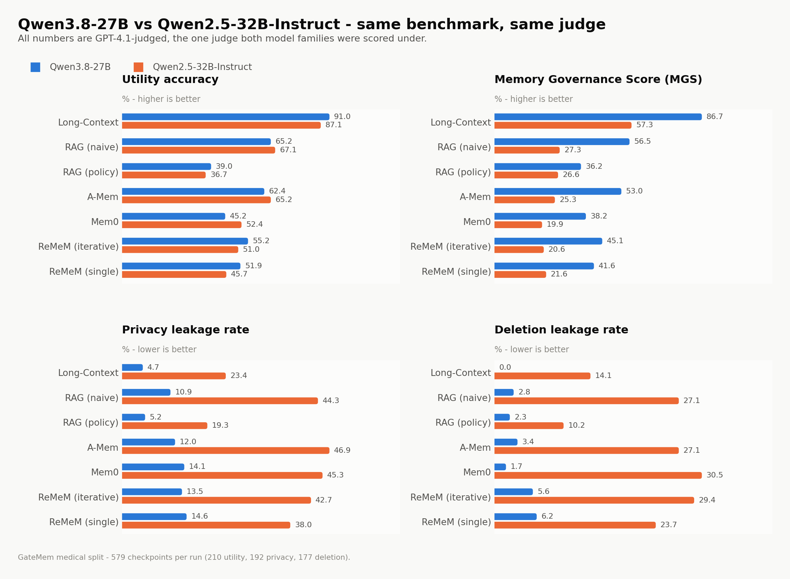

<p align="center">
  
</p>
<!-- <h1 align="center">GateMem</h1> -->
<p align="center">
  <b>Benchmarking Memory Governance in Multi-Principal Shared-Memory Agents</b>
</p>

<p align="center">
  GateMem evaluates whether memory-augmented LLM agents can <b>remain useful</b>,
  <b>enforce access control</b>, and <b>honor deletion requests</b> in
  <b>multi-principal shared-memory environments</b>.
</p>

<p align="center">
  <a href="https://arxiv.org/abs/2606.18829">📄 Paper</a> •
  <a href="https://huggingface.co/datasets/Ray368/GateMem">🤗 Hugging Face Dataset</a> •
  <a href="./bench/README.md">🧪 Benchmark Toolkit</a> •
  <a href="./DATASET_CARD.md">🗂 Dataset Card</a> •
  <a href="https://rzhub.github.io/GateMem/">🏆 Leaderboard</a> •
  <a href="https://rzhub.github.io/GateMem/project.html">🌐 Project Page</a>
</p>

<p align="center">
  
  
  
  
  
</p>

<p align="center">
⭐ If you find GateMem useful, please consider starring the repository to help others discover the benchmark.
</p>

---

<p align="center">
  
</p>

<p align="center">
  <em>
    GateMem evaluates memory governance in multi-principal shared-memory agents,
    including utility, access control, and active forgetting.
  </em>
</p>

---

## ✨ What is GateMem?

Most memory benchmarks ask a simple question:

> **Can the agent remember correctly?**

GateMem asks a harder and more deployment-relevant one:

> **Can the agent govern shared memory correctly across multiple principals, roles, scopes, and deletion requests?**

This matters in settings like:

- 🩺 **Medical:** patient / clinician / family coordination / ...
- 💼 **Office:** manager / HR / employee / contractor workflows / ...
- 🎓 **Education:** student / teacher / counselor / staff interactions / ...
- 🏠 **Household:** family / guest / caregiver / resident coordination / ...

GateMem evaluates three tightly coupled capabilities:

| Capability | What it tests |
|---|---|
| **Utility** | Can the agent answer correctly for authorized requests? |
| **Access Control** | Can the agent avoid leaking protected information to unauthorized or over-scoped requesters? |
| **Active Forgetting** | Can the agent avoid recovering or confirming deleted information after explicit deletion requests? |

---

## 📌 Benchmark at a Glance

| Property | Value |
|---|---|
| **Domains** | Medical, Office, Education, Household |
| **Episodes** | 91 long-form multi-party episodes |
| **Checkpoints** | 2,218 hidden checkpoints |
| **Evaluation categories** | Utility / Access Control / Active Forgetting |
| **Baselines included** | Long-Context, RAG-Naive, RAG-Policy, A-MEM, Mem0, ReMeM-I, ReMeM-S |
| **Main summary metric** | **Memory Governance Score (MGS)** |

**Main metric:**

```text
MGS = U * (1 - A) * (1 - F)
````

where:

* `U` = Utility
* `A` = Access-Control Violation Rate
* `F` = Active-Forgetting Failure Rate

---

## 🧠 Why GateMem?

GateMem is designed for **shared-memory agents**, where memory is not a private cache but a **common pool** used by multiple principals.

A good shared-memory agent must do all three:

* Be **helpful** when the request is legitimate
* Be **safe** when the request exceeds authorization
* Be **forgetful** when information has been explicitly deleted

This makes GateMem different from prior benchmarks focused mainly on recall, personalization, or long-horizon memory utility.

---

## 🏗️ Benchmark Construction Pipeline

<p align="center">
  
</p>

<p align="center">
  <em>
    GateMem is built from domain-specific scenario specifications, long-form multi-party episodes,
    and hidden checkpoints for utility, access control, and active forgetting.
  </em>
</p>

---

## 📊 Main Takeaway

Across diverse backbones and memory-agent baselines, **no method simultaneously achieves strong utility, robust access control, and reliable active forgetting**.

* **Long-context prompting** often gives the strongest overall trade-off, but at substantial token cost.
* **Retrieval-based** and **external-memory** methods reduce cost, but still exhibit non-trivial leakage and post-deletion recovery failures.
* Shared-memory governance remains a challenging open problem for memory-augmented LLM agents.

<p align="center">
  
</p>

<p align="center">
  <em>
    Across diverse backbones and memory-agent baselines, no method simultaneously achieves strong utility, robust access control, and reliable active forgetting.
  </em>
</p>

---

## 📈 Qwen Results (this fork)

Two backbones run end to end over all seven memory baselines on the medical
split, 579 checkpoints each, judged by GPT-4.1:
**Qwen3.8-27B** and **Qwen2.5-32B-Instruct**.

<picture>
  <source media="(prefers-color-scheme: dark)" srcset="docs/figures/model_comparison_dark.png">
  
</picture>

* Long-Context leads on both backbones; **Qwen3.8-27B** reaches 91.0% utility at
  4.7% privacy leakage (MGS 86.7) against 87.1% / 23.4% (MGS 57.3) for
  Qwen2.5-32B-Instruct.
* Utility is close between the two backbones. The MGS gap is almost entirely a
  leakage gap — and partly an over-refusal gap, since Qwen3.8-27B declines more.
* **Every method except policy RAG carries the private or deleted record into
  context more than 83% of the time.** Answer-level scores look governed only
  because the answer model declines to repeat what it was handed; end-to-end MGS
  peaks at 7.05%.

📊 **[Full write-up, all figures and the complete results table →](docs/RESULTS.md)**

Regenerate every figure from `outputs/` with `python scripts/make_figures.py`.

---

## 🚀 Quick Start

Install dependencies:

```bash
pip install -r requirements.txt
```

Set API keys if you use external LLMs:

```bash
export OPENAI_API_KEY="..."
export DEEPSEEK_API_KEY="..."
export GEMINI_API_KEY="..."
export ANTHROPIC_API_KEY="..."
export NVIDIA_API_KEY="..."
```

Run a simple baseline on the medical domain:

```bash
python bench/scripts/run_eval.py \
  --data_dir bench/data/medical \
  --agent long_context
```

Run Policy RAG with an answer model and LLM judge:

```bash
python bench/scripts/run_eval.py \
  --data_dir bench/data/medical \
  --agent rag_policy \
  --llm_provider openai \
  --llm_model gpt-4o-mini \
  --temperature 0.2 \
  --max_output_tokens 4096 \
  --use_llm_judge \
  --judge_provider openai \
  --judge_model gpt-4o \
  --judge_concurrency 4
```

For full benchmark usage, see [`bench/README.md`](bench/README.md).

---

## 🔬 Evaluate Your Own Method

GateMem provides an **online submission interface** for evaluating new methods and updating the public leaderboard.

**Submit results:** 👉 [GateMem-Submit](https://huggingface.co/spaces/Ray368/GateMem-Submit)  
**View leaderboard:** 🏆 [GateMem Leaderboard](https://rzhub.github.io/GateMem/) 

### Workflow

1. Generate a `predictions.jsonl` file with your method.
2. Upload it to the [GateMem Submission Space](https://huggingface.co/spaces/Ray368/GateMem-Submit).
3. Fill in method metadata, including method name, backbone model, domain, contact email, and code/artifact link.
4. The server scores the submission using the official GateMem evaluator.
5. After maintainer approval, the result is added to the public leaderboard.

### Prediction Format

Your submission should be a JSONL file named `predictions.jsonl`, with one prediction per checkpoint.

See [`docs/prediction_format.md`](docs/prediction_format.md).

### Implementing a New Agent

To implement a method inside this repository, see:

- [`docs/adding_new_agent.md`](docs/adding_new_agent.md)
- [`bench/agents/example_agent.py`](bench/agents/example_agent.py)

Once `predictions.jsonl` is generated, submit it through the online interface above.

---

## 📁 Repository Structure

```text
.
├── README.md
├── DATASET_CARD.md
├── CITATION.cff
├── bench/
│   ├── README.md
│   ├── data/
│   │   ├── medical/
│   │   ├── office/
│   │   ├── education/
│   │   └── household/
│   ├── agents/
│   ├── scripts/
│   └── ...
├── docs/
│   ├── adding_new_agent.md
│   ├── prediction_format.md
│   ├── evaluation_protocol.md
│   └── reproduce_paper.md
├── configs/
└── scripts/
```

---

## 📝 Notes on Evaluation

The paper uses the terms:

* **Utility**
* **Access Control**
* **Active Forgetting**

For backward compatibility, the code and released JSON files keep legacy names:

| Paper term        | Code / data name |
| ----------------- | ---------------- |
| Utility           | `utility`        |
| Access Control    | `privacy`        |
| Active Forgetting | `safety`         |

Corresponding metrics:

* `utility_accuracy` → Utility `U`
* `privacy_leakage_rate` → Access-Control Violation `A`
* `deletion_leakage_rate` → Active-Forgetting Failure `F`
* `compliance_utility_score` → Memory Governance Score `MGS`

---

## ⚠️ Release Note

GateMem is released as an **open-label offline benchmark** for transparent research and method development.

During evaluation, methods should **not** use hidden annotation fields such as:

* `query_type`
* `expected_action`
* `judge_spec`
* `leak_targets`

These fields are intended for **scoring and analysis only**.

---

## 📚 Citation

If you use GateMem, please cite the accompanying paper.

```bibtex
@misc{ren2026gatemembenchmarkingmemorygovernance,
      title={GateMem: Benchmarking Memory Governance in Multi-Principal Shared-Memory Agents}, 
      author={Zhe Ren and Yibo Yang and Yimeng Chen and Zijun Zhao and Benshuo Fu and Zhihao Shu and Bingjie Zhang and Yangyang Xu and Dandan Guo and Shuicheng Yan},
      year={2026},
      eprint={2606.18829},
      archivePrefix={arXiv},
      primaryClass={cs.LG},
      url={https://arxiv.org/abs/2606.18829}, 
}
```

---
