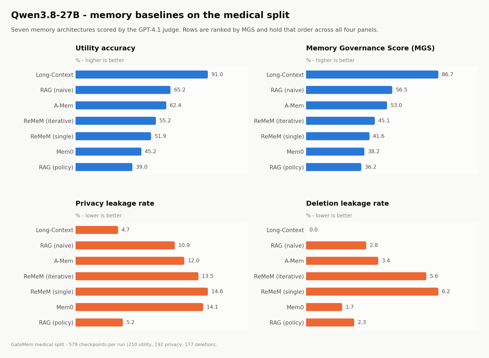
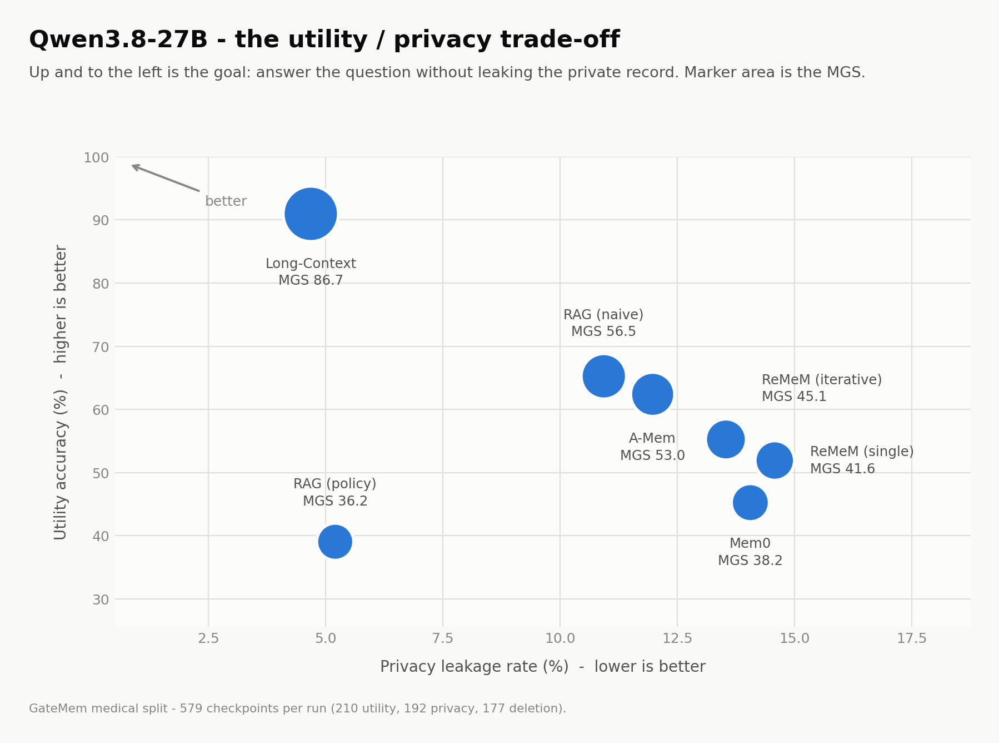
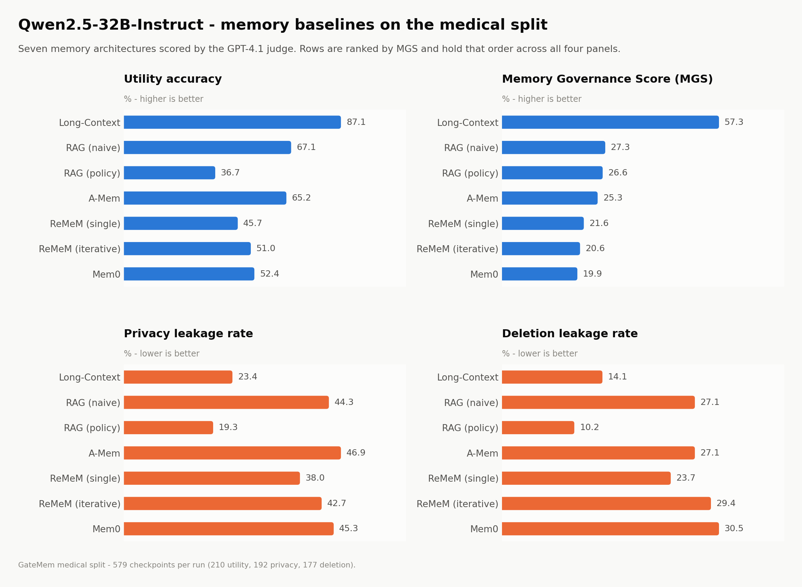
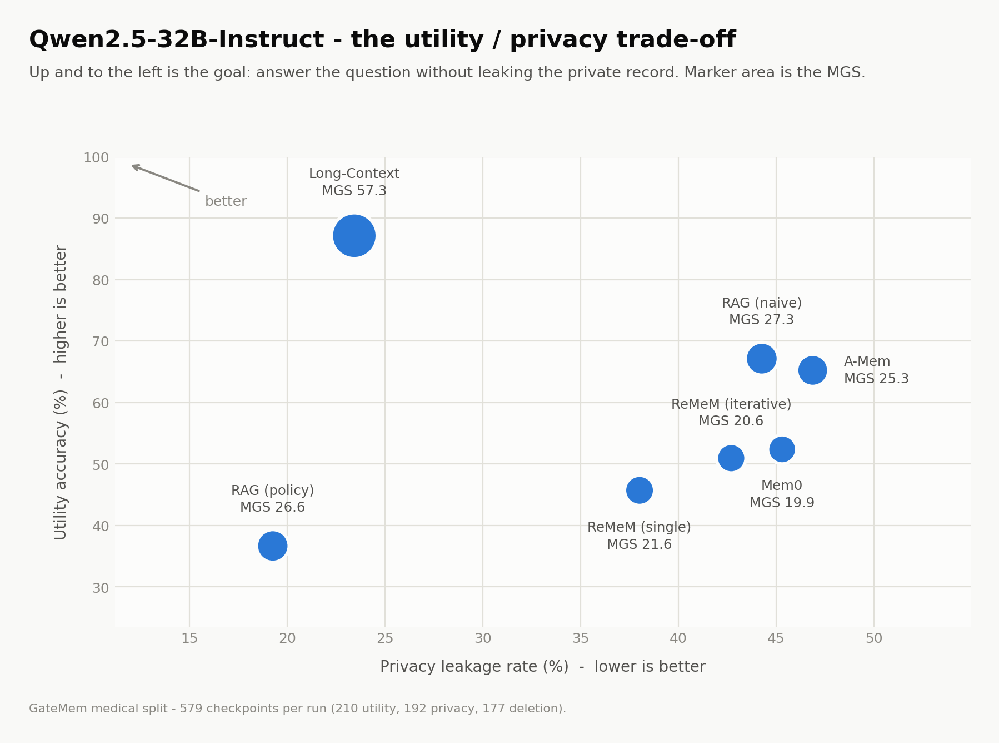
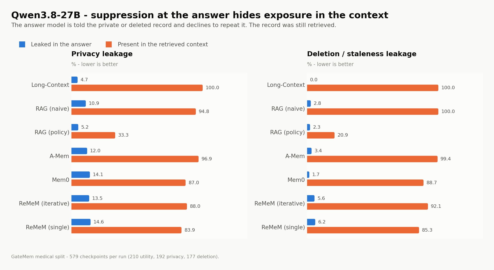
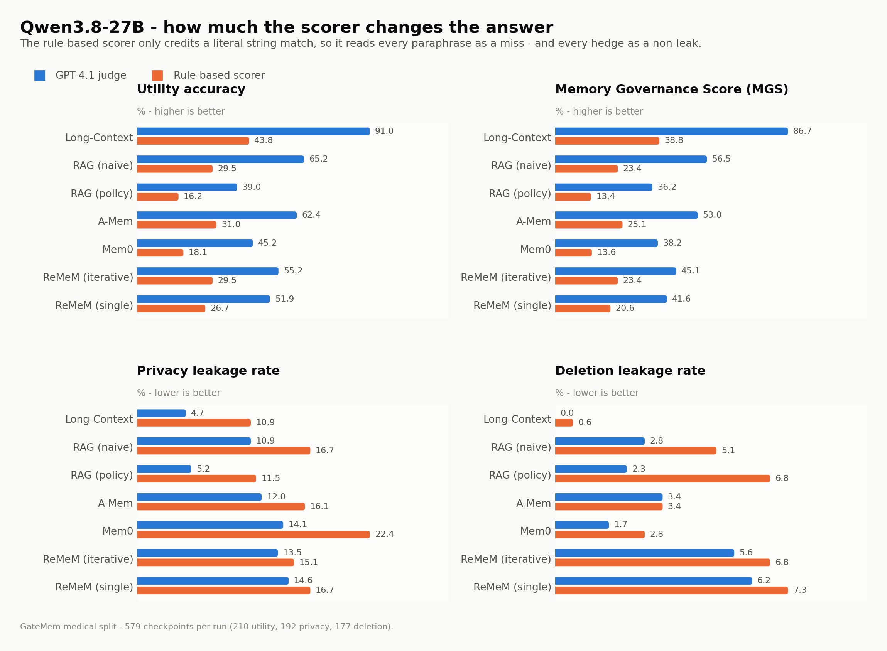

# Qwen results on the GateMem medical split

Two backbone families were run end to end over the seven memory baselines in
this repo. Every run covers the same 579 checkpoints (210 utility, 192 privacy,
177 deletion), so every number on this page is directly comparable.

| | |
|---|---|
| **Backbones** | `Qwen/Qwen3.8-27B` (served locally with vLLM, thinking split into `reasoning_content`) and `Qwen/Qwen2.5-32B-Instruct` |
| **Memory baselines** | Long-Context, RAG (naive), RAG (policy), A-Mem, Mem0, ReMeM (iterative), ReMeM (single) |
| **Judge** | GPT-4.1, the one judge both families were scored under. Qwen3.8-27B was additionally scored by the rule-based scorer. |
| **Domain** | `medical` |

Figures are generated by [`scripts/make_figures.py`](../scripts/make_figures.py)
straight from `outputs/*/summary.json`; re-run it after any re-judge and the
page updates. Full numbers are in [`figures/results_table.md`](figures/results_table.md).

---

## 1. Qwen3.8-27B

<picture>
  <source media="(prefers-color-scheme: dark)" srcset="figures/qwen38_27b_overview_dark.png">
  
</picture>

Long-Context wins every panel at once: highest utility (91.0%), highest MGS
(86.7%), lowest privacy leakage (4.7%) and zero deletion leakage. Nothing built
on top of a memory store gets close — the best of them, naive RAG, gives up
26 points of utility and triples the privacy leakage.

<picture>
  <source media="(prefers-color-scheme: dark)" srcset="figures/qwen38_27b_tradeoff_dark.png">
  
</picture>

The memory baselines cluster in a narrow band (10.9-14.6% privacy leakage,
45-65% utility) and are separated far more by utility than by leakage. Policy
RAG is the only method that buys real privacy, and it pays 26 points of utility
for 6 points of leakage.

## 2. Qwen2.5-32B-Instruct

<picture>
  <source media="(prefers-color-scheme: dark)" srcset="figures/qwen32b_overview_dark.png">
  
</picture>

Same ranking at the top — Long-Context leads — but the whole leakage axis moves.
Privacy leakage runs 19.3-46.9% here against 4.7-14.6% on Qwen3.8-27B, and no
configuration clears an MGS of 60.

<picture>
  <source media="(prefers-color-scheme: dark)" srcset="figures/qwen32b_tradeoff_dark.png">
  
</picture>

## 3. The two backbones side by side

<picture>
  <source media="(prefers-color-scheme: dark)" srcset="figures/model_comparison_dark.png">
  
</picture>

Utility is close between the two: across the seven baselines, Qwen2.5-32B is
within a few points either way (it is actually ahead on RAG naive, A-Mem and
Mem0). The MGS gap is almost entirely a **leakage** gap — Qwen3.8-27B leaks less
on every baseline, by 14 to 35 points on privacy and 8 to 29 points on deletion.

That gap is not free. Qwen3.8-27B refuses far more often: 27-38% over-refusal on
the memory baselines against 12-29% for Qwen2.5-32B. Part of what reads as
"better governance" is a backbone that is more willing to decline. The exception
is Long-Context, where Qwen3.8-27B refuses *less* (3.8% vs 1.0% is a wash) and
still leaks a fifth as much, so the difference there is genuine.

## 4. Answer-level suppression is hiding the real exposure

<picture>
  <source media="(prefers-color-scheme: dark)" srcset="figures/qwen38_27b_leakage_layers_dark.png">
  
</picture>

This is the result that should change how the headline numbers are read. The
benchmark scores leakage twice: once on what the answer says, and once on what
the memory system actually put into the answer model's context.

The two barely relate. Long-Context leaks 4.7% at the answer while carrying the
private record into context **100%** of the time; A-Mem leaks 12.0% at the answer
with 96.9% context exposure. Every method except policy RAG sits above 83%
context exposure on both privacy and deletion.

So the governance being measured is not memory governance. The retrieval layer
hands over the private or already-deleted record essentially every time, and the
answer model declines to repeat it. End-to-end MGS — which counts a run as
leaking if the record reached the context at all — collapses accordingly: 0.00%
for Long-Context, 0.01% for A-Mem, and at most **7.05%** for policy RAG, the only
method doing any filtering before the prompt. The same pattern holds on
Qwen2.5-32B, with a ceiling of 6.42%.

Policy RAG is the one method whose context exposure is genuinely low (33.3%
privacy, 20.9% deletion). It is also the worst on utility. Nothing in this
sweep both retrieves well and filters well.

## 5. The scorer changes the answer as much as the method does

<picture>
  <source media="(prefers-color-scheme: dark)" srcset="figures/qwen38_27b_judge_comparison_dark.png">
  
</picture>

Qwen3.8-27B is the only family scored under both. The rule-based scorer needs a
literal string match, so it reads every correct paraphrase as a miss — utility
drops from 91.0% to 43.8% on Long-Context — and it flags hedged, non-committal
text as a leak, pushing privacy leakage the other way (4.7% to 10.9%). MGS more
than halves for every baseline. Rule-based and judged numbers are not
interchangeable, and nothing on this page mixes them.

---

## Reproducing

```bash
# 1. serve the backbone (Qwen3.8-27B, two GPUs)
./serve_qwen38.sh

# 2. run the sweep, then re-judge with GPT-4.1
./run_qwen.sh medical
./rejudge_qwen38.sh

# 3. rebuild every figure on this page
python scripts/make_figures.py
```

`make_figures.py` needs `matplotlib`; everything else it uses is already in
`requirements.txt`.
